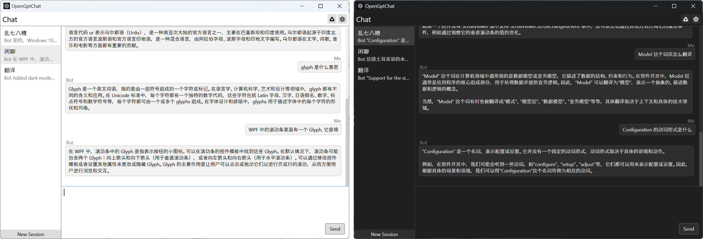

# OpenGptChat 

    /  

基于 [Open AI Chat API](https://platform.openai.com/docs/guides/chat) 的简易聊天客户端

## 功能

1. 实时响应. 通过使用 `HTTP Stream`, 在服务器响应每一个字的时候, 程序都能将它展示到屏幕上, 而无需等待整个响应完成.
2. 多会话. 你可以在程序左侧创建多个会话, 每一个会话都有独立的聊天内容, 它们是互不干扰的, 你可以随意切换.
3. 多语言. 第一次启动时, 程序会检测你的系统语言, 如果是支持的语言, 程序会自动切换至对应语言, 你也可以在配置中手动切换.
4. 热更新. 你在配置页面更改的配置信息, 都会立即在程序中生效, 而无需你保存配置并重启程序, 包括置顶选项与语言设置.
5. 热键. 作为一个便捷的工具, OpenGptChat 提供了隐藏与还原的热键, 它们分别是 `Ctrl+H` 以及 `Ctrl+Shift+H`, 你可以在任何地方唤起程序.

## 使用方法

1. 在 `Releases` 中下载最新的版本.
2. 创建一个文件夹, 并将 `OpenGptChat.exe` 移动到文件夹内.
3. 打开 `OpenGptChat.exe`, 它会自动在所在位置生成配置文件及数据库文件
4. 转到配置页面并设置自己的 `API 密钥`, 或者也可以自定义 `系统消息`
5. 坐和放宽, 享受 `OpenGptChat` 带来的乐趣罢!

> 小提示：您可以在文本框中使用 `Ctrl + Enter` 发送消息。

## 什么是 API 密钥

OpenAI API 使用API密钥进行身份验证。请前往您的[API 密钥](https://platform.openai.com/account/api-keys)页面检索您在请求中会使用的 API 密钥。通常情况下，API 密钥是秘密的，不应与他人共享。

## 您可以学到什么？

1. 学习 WPF 中的 **Binding**、**Command**、**Template**、**Style**、**Trigger**、**Animation**
2. 使用 `LiteDB` 保存数据而无需编写 SQL 语句.
3. 使用 `CommunityToolkit.Mvvm` 以便捷实现可绑定数据与命令.
4. 使用 `Microsoft.Extensions.Hosting` 进行服务管理, 配置与依赖注入
5. 使用 `Hardcodet.NotifyIcon.Wpf` 在 WPF 程序中创建通知图标.
6. 使用 `Microsoft.Xaml.Behaviors.Wpf` 在 WPF 程序中添加更多操作方式.
7. 使用 `EleCho.GlobalHotkey.Windows.Wpf` 在 WPF 程序中处理全局热键.

## FAQ

- Q: 为什么我设置的 `系统消息` 没有生效? \
  A: 由于 `系统消息` 的特殊性, 你需要在设置 `系统消息` 后点击 `应用` 按钮.